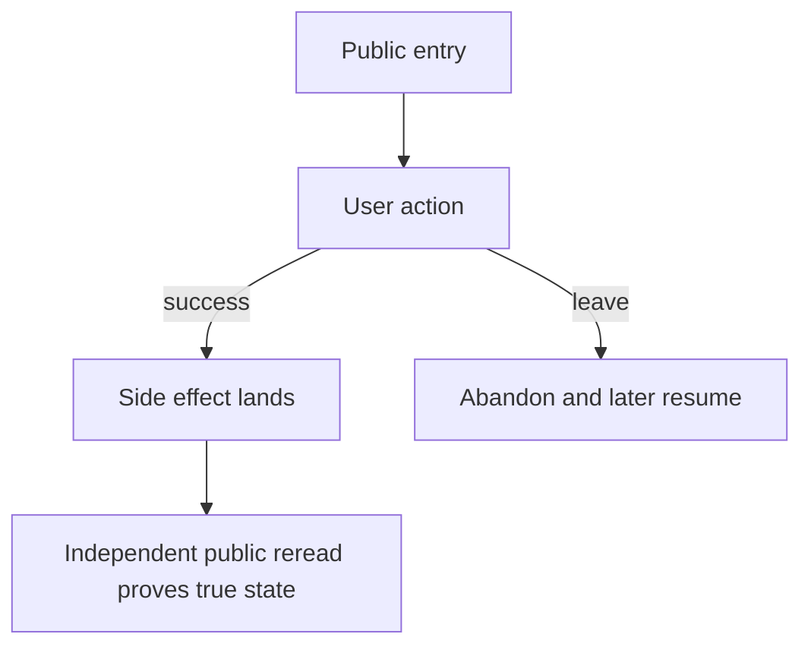

# QA planning contract

This method is distilled from Pedro Nauck's work at
<https://github.com/pedronauck/skills>; its wording and host constraints are
Batuta's. Apply it inside the living tree defined by [tree.md](tree.md).

## Contents

- Personas
- Journeys and flows
- Scenarios and coverage
- Session charters and ledger
- Automation backlog
- Planning completeness

## Personas

A persona fixes the user's goal, familiarity, environment, patience, and
interaction modality for a session. Keep 3–6 product-specific personas in
`personas.md`; revise them when the audience changes, not for each cycle. Include
a mobile persona when a mobile surface exists and an accessibility-reliant
persona unless the file records why that perspective is out of scope.

```markdown
## <project persona name>
- Base: new | power | casual | mobile | accessibility-reliant | recovering
- Goal: <product value sought>
- Familiarity: <prior experience>
- Device/network: <realistic conditions>
- Modality/locale: <mouse, touch, keyboard, assistive tech; locale>
- Patience: <abandonment threshold>
- Reveals: <likely risks>
```

Choose the persona most harmed by a failure in the journey. Do not switch
personas mid-session; a second perspective gets another charter.

## Journeys and flows

A journey names value a user reaches across entry, actions, branches, side
effects, destination, and aftermath. Write the Mermaid flow before any scenario
is derived, with at least one abandonment-and-resume path. The terminal node is
the true end state, never merely a click or successful response.

````markdown
---
id: J-<value-slug>
name: <verb-noun value>
personas: <names separated by semicolons>
entry_points: <public URLs, CLI verbs, or HTTP endpoints>
crosses: <services or teams separated by semicolons>
---
# <journey name>

## Actions
1. <user verb> — <immediate public observable>
## True end state
<value, destination, and landed side effects>
## Abandonment
<where the user leaves, what persists, and how they resume>
````

Browser, CLI, and HTTP journeys are first-class. For example, after
`tool create`, prove the id with a separate public `tool show <id>` invocation;
after `POST /orders`, prove persistence with an independently authenticated
`GET /orders/<id>`. Do not use process memory, private storage, mocks, logs, or
the write response as the reread.

Walk every flow node and edge to derive a happy path, plausible branches,
abandonment/resume, and landed side effects. Split a journey that contains two
distinct user values.

## Scenarios and coverage

Write each persona-observable promise using the scenario schema in
[tree.md](tree.md). Preserve existing verdicts and report links unless new
evidence supersedes them; newly derived scenarios start `untested`. During
bootstrap, seed `scenario.md` under the QA tree's `templates/` directory from
that same schema.

Use five dimensions as lenses, not as a case matrix:

1. **Journey:** entry through destination and aftermath.
2. **Functional:** validation, links, round trips, and authorization.
3. **Experiential:** usability, accessibility, perceived speed, compatibility, recovery, and production parity.
4. **Edge/error/empty:** realistic failure, empty, concurrency, refresh, retry, and abandonment states.
5. **Cross-cutting:** responsiveness, adjacent regression, consistency, and continuity.

Record coverage per journey in the cycle's durable
`reports/<YYYY-MM-DD>-<scope>-<run-id>.md`, following the run identity and resume
rules in [tree.md](tree.md#id-and-merge-rules). Every dimension points to a
scenario or charter, or carries an explicit skip reason.

```markdown
| Journey | Dimension | Scenario/charter | Status or skip reason |
|---|---|---|---|
| J-<slug> | journey | <ids> | planned |
| J-<slug> | functional | <ids> | planned |
| J-<slug> | experiential | <ids or none> | <planned or explicit reason> |
| J-<slug> | edge/error/empty | <ids or none> | <planned or explicit reason> |
| J-<slug> | cross-cutting | <ids or none> | <planned or explicit reason> |
```

## Session charters and ledger

A charter is the immutable mission for one time-boxed session with exactly one
tour. Reuse a charter
whose mission still fits; create a new content-addressed `CH-<mission-slug>.md`
when the mission changes. After execution, debrief in the dated report rather
than editing the charter. During bootstrap, seed `charter.md` under the QA
tree's `templates/` directory with this format and use it for every new charter.

```markdown
---
id: CH-<mission-slug>
persona: <project persona>
journey: J-<slug>
tour: <exactly one exploratory lens>
time_box_minutes: 30 | 60 | 90
scenarios: <ids separated by semicolons>
---
# Mission
<one sentence: investigate what, under which risk, and why>
## Must try
- <guidance that preserves exploration rather than scripted clicks>
## End condition
<true end state or exact blocked prerequisite>
```

Choose smoke (highest-value journeys), targeted (changed plus one adjacent),
full (all high-priority journeys and personas), or sanity (fixed plus one
adjacent). Order sessions by impact and blast radius. Every in-scope journey
needs at least one persona charter.

Coverage is a session ledger in the same dated cycle report, never a per-case
count:

```markdown
| Charter | Persona | Journey | Time box | Planned/run | Debrief report | Blocked prerequisite |
|---|---|---|---:|---|---|---|
| CH-<slug> | <name> | J-<slug> | 60 | planned | — | — |
```

If a leg cannot run headlessly, keep it in the ledger as blocked and name the
exact missing human, browser capability, account/role, reachable service, or
product decision. A vague `browser unavailable` or `needs access` is invalid.

## Automation backlog

Use one file per intent at `automation-backlog/<value-slug>.md`; deduplicate by
source and slug. Add only a stable high-value journey, a repeated regression,
or a fix replay that lacks a durable regression check. Automation never replaces
persona sessions.

```markdown
# <journey or scenario title>
- Source: <journey, scenario, or bug ids>
- Why automate: <stable value, repeated regression, or missing fix check>
- Suggested layer: <browser E2E, API/integration, or unit>
- Spec sketch: <entry, key observables, independent true-state reread>
- Status: proposed | accepted | implemented (<path>) | rejected (<reason>)
```

## Planning completeness

The handoff is complete when every in-scope journey has a flow with a true end
state and abandonment path, at least one persona charter, and all five coverage
dimensions linked or explicitly skipped. Scenario ids resolve, new ones remain
`untested`, prior verdicts remain intact, and the session ledger records every
planned walk and exact blocked prerequisite. Completeness is measured by
journeys walked by personas, never by scenario-file totals.
